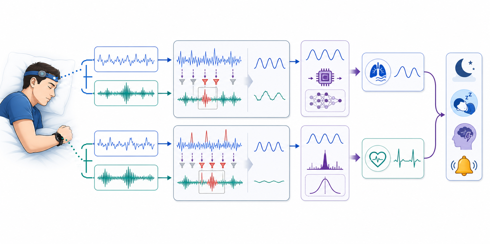

# Wearable Motion-Aware Physio Monitoring

Research prototypes for motion-aware heart-rate and breathing-rate estimation from wearable and head-worn PPG and IMU signals.

This repository is a public research summary of active work in wearable health sensing. It highlights the problem framing, modeling approaches, validation strategy, deployment direction, and synthetic demonstrations of motion artifact handling without publishing private data, ongoing research models, or the full unpublished implementation.

## System Overview

The project centers on motion-aware estimation from wearable PPG and IMU streams, especially in sleep and resting contexts where posture changes and movement can still corrupt physiological signals.



The overview shows the intended flow: headband and wrist-worn sensors provide PPG and IMU streams, motion-aware processing detects or suppresses motion-contaminated segments, and downstream estimators produce breathing-rate and heart-rate outputs for sleep-related monitoring.

## Motivation

Wearable physiological signals are noisy in real settings. Photoplethysmography (PPG) can carry heart-rate and respiration-related information, and IMU streams can capture respiratory motion, but movement can create misleading peaks, amplitude shifts, dropouts, and frequency content. This project explores ways to estimate physiology from wearable signals while explicitly accounting for motion.

The work focuses on two research tracks:

- **Breathing-rate estimation:** Prototypes using head-worn PPG plus accelerometer features, wrist PPG plus accelerometer deep learning, and head accelerometer-only signals.
- **Heart-rate estimation:** PPG-derived heart-rate estimation with IMU-assisted motion suppression, signal-quality checks, temporal tracking, and comparison against external reference devices.

## High-Level Approach

The full research implementation explores a pipeline with these stages:

1. Synchronize wearable PPG and IMU streams.
2. Detect low-quality or motion-dominated windows.
3. Apply signal filtering and motion-aware gating.
4. Estimate heart rate or breathing rate from window-level features or learned models.
5. Compare estimates with reference devices and summarize error, correlation, and bias.

See [docs/method_overview.md](docs/method_overview.md) for a fuller overview.

## Public Code Layout

The public code is intentionally limited to synthetic demos and reusable teaching utilities:

```text
src/wearable_physio/
  preprocessing.py      # basic bandpass filters
  signal_quality.py     # simple motion and quality scores
  synthetic.py          # synthetic PPG, IMU, and respiratory-motion generators
  heart_rate.py         # public heart-rate demo estimator
  breathing_rate.py     # public breathing-rate demo estimators
  metrics.py            # demo metrics
  visualization.py      # demo plots

examples/
  synthetic_motion_artifact_demo.py
  synthetic_breathing_imu_demo.py
```

These files demonstrate the concept only. They are not the private research implementation.

## Synthetic Demos

Create an environment and install the minimal demo dependencies:

```bash
python -m venv .venv
source .venv/bin/activate
pip install -r requirements.txt
```

Run the heart-rate motion artifact demo:

```bash
python examples/synthetic_motion_artifact_demo.py
```

Expected output:

```text
Synthetic motion-aware PPG heart-rate demo
Synthetic heart-rate range: 68.1-76.2 bpm
Windows analyzed: 43
Motion-dominated windows flagged: 19
Raw window MAE: 10.02 bpm
Accepted-window MAE after motion gating: 0.22 bpm
Note: rejected windows are excluded instead of forced into an estimate.
Saved plot: demo_outputs/synthetic_motion_artifact_demo.png
```

This HR demo is a simplified public analog of motion-aware handling: IMU-heavy windows are gated rather than reproducing the full private HR estimator, temporal tracking, or mobile app logic.

Run the breathing-rate IMU demo:

```bash
python examples/synthetic_breathing_imu_demo.py
```

Expected output:

```text
Synthetic respiratory-IMU breathing-rate demo
Synthetic breathing-rate range: 12.8-15.2 breaths/min
Windows analyzed: 19
Motion-dominated windows flagged: 10
Respiratory-band PSD MAE: 0.23 breaths/min
Accepted-window PSD MAE: 0.24 breaths/min
Toy sequence-model demo MAE: 0.23 breaths/min
Accepted-window coverage: 47.4%
Note: the toy sequence model is a fixed-filter demo, not the private trained model.
Saved plot: demo_outputs/synthetic_breathing_imu_demo.png
```

The breathing-rate example includes two public-safe paths:

- Synthetic respiratory motion -> IMU signal -> respiratory-band filtering -> Welch/PSD peak -> breathing-rate estimate.
- Synthetic respiratory motion -> IMU signal -> toy sequence-model-style estimator -> breathing-rate estimate.

The toy sequence-model path is deliberately simple and uses no trained weights. It is included only to make the public demo mirror the research direction at a high level.

Generated plots are saved under `demo_outputs/`, which is ignored by git.

## Preliminary Results

The research prototypes have shown promising preliminary performance in controlled evaluations, but the work is not clinically validated and should not be used for medical decision-making. See [docs/results_summary.md](docs/results_summary.md).

## Deployment Prototype

The private implementation also includes iOS deployment prototypes for real-time estimation from wearable streams. See [docs/deployment.md](docs/deployment.md).

## What Is Public vs. Private

This repository is intentionally limited to public-safe materials.

Included:

- Research motivation and project framing.
- High-level method descriptions.
- Summarized preliminary results.
- Synthetic-only demonstration code.
- Notes about limitations and active research status.

Not included:

- Private raw physiological data.
- Exact unpublished research implementation.
- Trained model weights.
- Core ML packages or mobile deployment artifacts.
- Device credentials.
- Private paths, experiment logs, and full evaluation outputs.
- Any file that would allow direct reproduction of the full private pipeline.

The public materials should be enough for a reviewer to understand that the project involves wearable sensing, physiological signal processing, motion artifacts, machine learning prototypes, and reference-device evaluation. They are not intended to reproduce the full research pipeline.

## Status

This is an active research repository. The public materials are designed to describe the research direction and engineering scope while preserving unpublished methods and private data.
