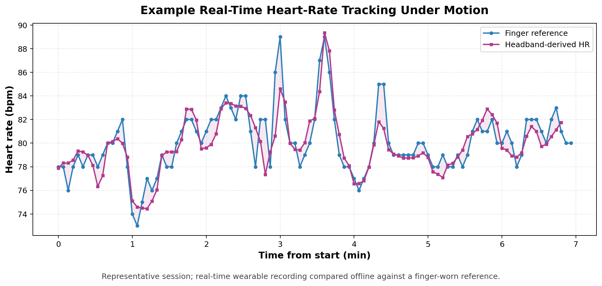

# Deployment Prototype

The private implementation includes real-time mobile prototypes for both breathing-rate and heart-rate estimation. This page summarizes the deployment direction without publishing the application source code, private data, or exact unpublished pipelines.

## Breathing-Rate Estimation

The trained breathing-rate model was converted into Apple Core ML format and embedded in an iOS prototype.

The iOS app connects to wearable devices and runs estimation on real-time signal windows:

- A head-worn brainband provides head PPG and head IMU streams.
- A Galaxy Watch provides wrist PPG and wrist IMU streams.
- The app buffers incoming signals, prepares model input windows, and runs breathing-rate estimation locally on device.

This deployment path was used to test whether the research model could run with live wearable streams rather than only offline files.

## Heart-Rate Estimation

The heart-rate estimator is a signal-processing pipeline rather than a trained model, so it was implemented directly in an iOS prototype.

The app connects to a head-worn brainband and performs real-time heart-rate estimation from PPG with motion-aware handling. During experiments, the app recorded the estimated heart-rate trace while an O2Ring-style finger reference recorded heart rate independently.

The experimental protocol included both low-motion and high-motion conditions:

- Lying still.
- Lying with large movements, including turning around.

After the experiment, the app recording and finger-reference recording were aligned and compared offline. In evaluated sessions, the derived heart-rate trace remained stable during movement and aligned with the reference, reaching Pearson correlation up to **0.809** and mean absolute error as low as **1.2 bpm**.

Representative comparison from a real-time wearable recording. The public figure uses relative time and neutral labels; raw recordings and full experiment files are not included.

## Disclosure Boundary

The deployment summary is intentionally high level. The iOS source code, device integration details, model files, private recordings, and full validation outputs are not included in this public repository.
